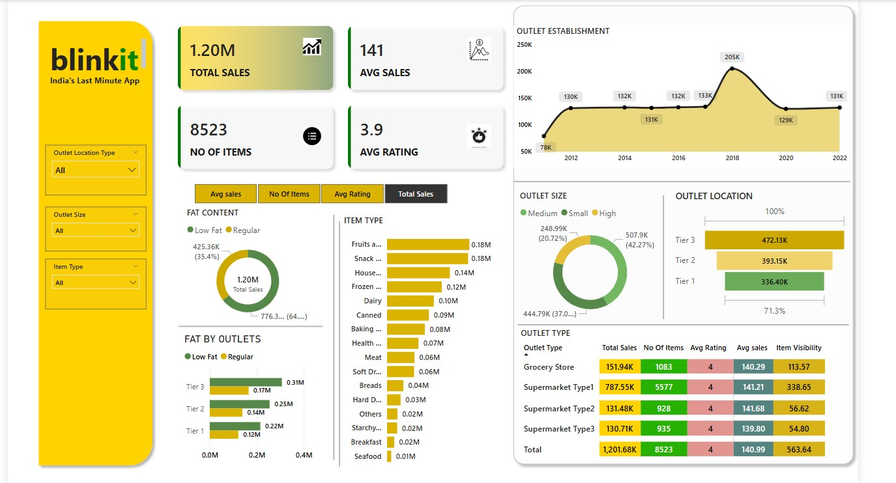

## 📊 Blinkit Sales Dashboard

**Blinkit** - *India’s Last Minute App*
This dashboard provides a comprehensive visualization of product sales, outlet performance, and customer preferences across various regions, item types, and outlet formats.



---

### 🔍 Overview

This interactive dashboard summarizes key metrics and trends in Blinkit’s retail sales, helping stakeholders gain insights into:

* Total Sales and Average Sales
* Number of Items Sold
* Average Ratings by Outlet
* Performance by Item Type, Fat Content, and Outlet Category
* Outlet establishment trends from 2010 to 2022

---

### 📈 Key Features

* **Total Sales:** 1.20M units sold
* **Average Sales per Outlet:** 141
* **Total Items Tracked:** 8,523
* **Average Customer Rating:** 3.9

#### Visualized Metrics Include:

* 📅 Sales Trends by Year
* 🛍️ Item Type-wise Sales (e.g., Fruits, Snacks, Dairy)
* 🧈 Fat Content Preference (Low Fat vs Regular)
* 🏬 Outlet Size & Location Analysis (Tier 1, 2, 3)
* 🏪 Outlet Type Comparison (Grocery Store vs Supermarket Types)
* 🎯 Visibility Score by Outlet Type

---

### 📌 Insights

* **Highest sales** are recorded from **Supermarket Type 1** outlets.
* **Tier 3 outlets** contribute the largest share of total sales (472.13K).
* Customers favor **Regular fat content** items slightly more than low-fat ones.
* The product category with the **highest sales** is a tie between **Fruits** and **Snacks**, each contributing approx. 0.18M.
* Outlet establishment peaked in **2018**, with over **205K** outlets.

---

### 🛠️ Built With

This dashboard appears to be created using **Microsoft Power BI** with dynamic filtering enabled for:

* Outlet Location Type
* Outlet Size
* Item Type

---

### 📁 Repository Contents

```plaintext
📁 blinkit-dashboard/
├── BLINKIT_DASHBOARD.jpg        # Dashboard Image
├── README.md                    # Project Description
└── blinkit_report.pbix (optional)  # Power BI file (if you want to add source file)
```

---

### 📌 Use Cases

* **Retail Sales Strategy**
* **Inventory & Supply Chain Optimization**
* **Customer Behavior Analysis**
* **Outlet Performance Monitoring**
* **Data-Driven Decision Making**

---

### 📬 Contact

For questions, feel free to open an issue or reach out to the maintainer.

